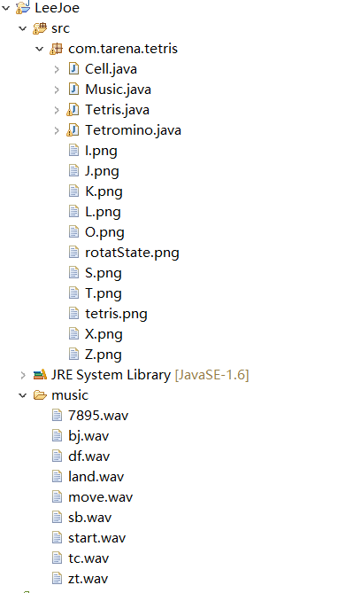
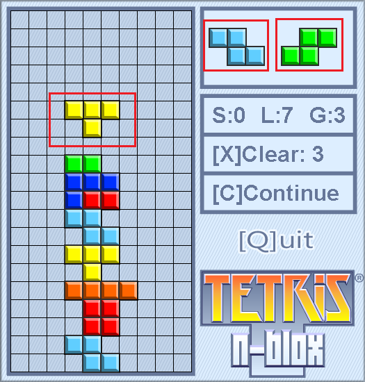
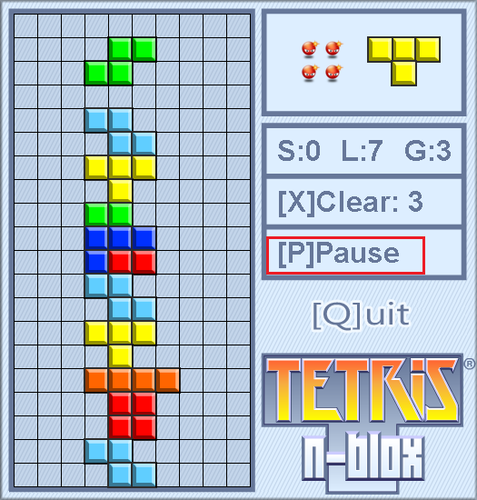
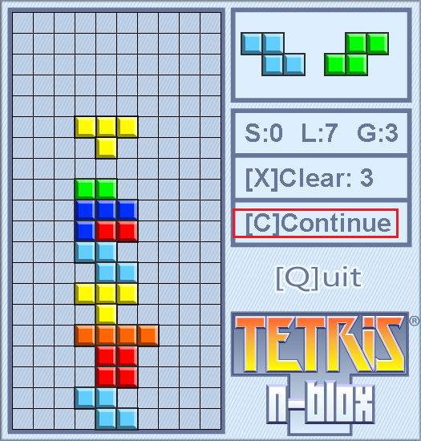
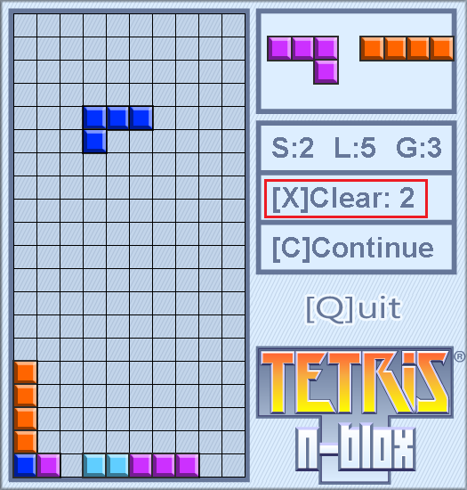
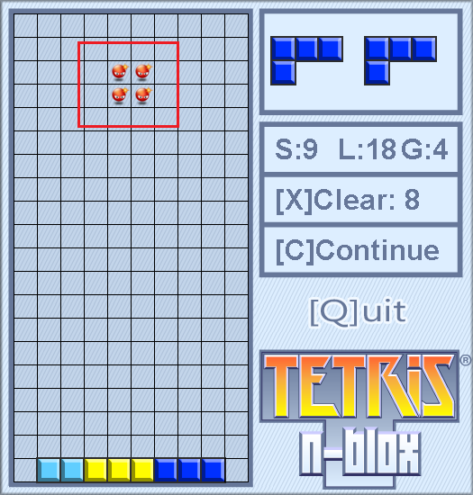
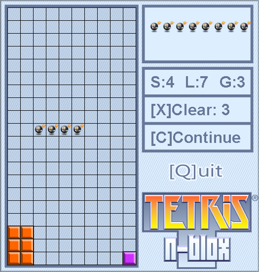
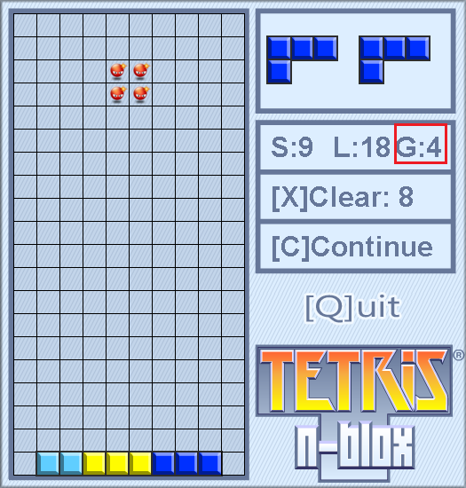
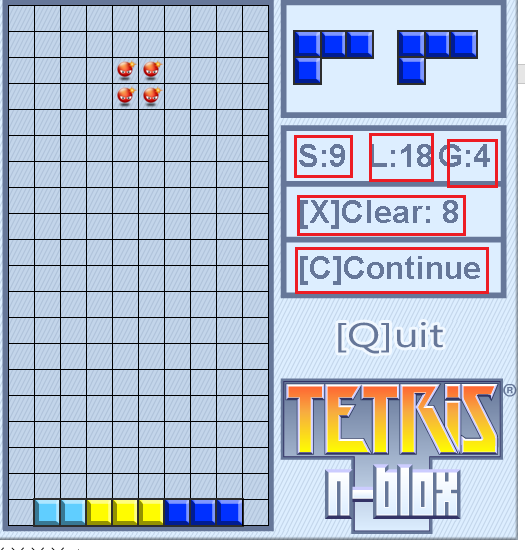
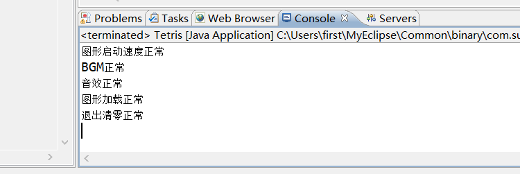

# Tetris
山 东 工 商 学 院
《Java程序设计》编程应用


题  目：俄罗斯方块游戏设计和改进
   
姓    名：李哲
学    院：管理科学与工程学院
专    业：信息管理与信息系统专业
班    级：信外171
学    号：2017230010
指导教师： 张媛媛         


2019年 12月20日


## 1.课程设计的目的
通过本课程设计使学生能够较全面掌握面向对象程序设计的基本概念和开发方法，以便能较全面的理解、掌握和综合运用所学的知识。
## 2.整改系统功能描述
结构图示
 


### 1、音效
对音效函数进行了封装，方便后续调用
```java
public class Music {
    AudioClip bj1,bj2,move,over,sorce,land,exit,suspend,start;
    public void init(){//背景音乐播放
        try {
            
            bj1 = Applet.newAudioClip(new File("music/bj.wav").toURI().toURL());
            bj2 = Applet.newAudioClip(new File("music/7895.wav").toURI().toURL());
            move = Applet.newAudioClip(new File("music/move.wav").toURI().toURL());
            over = Applet.newAudioClip(new File("music/sb.wav").toURI().toURL());
            sorce = Applet.newAudioClip(new File("music/df.wav").toURI().toURL());
            land = Applet.newAudioClip(new File("music/land.wav").toURI().toURL()); 
            exit = Applet.newAudioClip(new File("music/tc.wav").toURI().toURL());
            suspend = Applet.newAudioClip(new File("music/zt.wav").toURI().toURL());
            start = Applet.newAudioClip(new File("music/start.wav").toURI().toURL());
            System.out.println("BGM正常");
            System.out.println("音效正常");
            
 
        } catch (MalformedURLException e) {
            e.printStackTrace();
        }
        System.out.println("图形加载正常");
    }
    
    public void playBj1(){
        bj1.loop();//循环播放
    }
    public void stopBj1(){
        bj1.stop();
    }
    
    public void playBj2(){
        bj2.loop();
    }
    public void stopBj2(){
        bj2.stop();
    }
    
    public void playMove(){
        move.play();
    }
    public void stopMove(){
        move.stop();
    }
    
    public void playOver(){
        over.play();
    }
    public void stopOver(){
        over.stop();
    }
    
    public void playSorce(){
        sorce.play();
    }
    public void stopSorce(){
        sorce.stop();
    }
    
    public void playLand(){
        land.play();
    }
    public void stopLand(){
        land.stop();
    }
    
    public void playExit(){
        exit.play();
    }
    public void stopExit(){
        exit.stop();
    }
    
    public void playSuspend(){
        suspend.play();
    }
    public void stopSuspend(){
        suspend.stop();
    }
    
    public void playStart(){
        start.play();
    }
    public void stopStart(){
        start.stop();
    }
}
```


### 2、视口预览下次 下下次的图形
 
代码实现
初始化产生
```java
    public void startAction(){
        
        clearWall();
        tetromino = Tetromino.randomTetromino();
        nextOne = Tetromino.randomTetromino();
        nextNextOne = Tetromino.randomTetromino();
        System.out.println("预窗格加载");
        
        lines = 0; 
        score = 0;  
        pause=false; 
        gameOver=false;
        

        softDropAction();
        System.out.println("图形启动速度正常");
    }
```

运行时的产生
```java
    public void moveAction(){
        if(tetrominoCanDrop()){
            tetromino.softDrop();
        }else{
            if (tetromino.getFlagCell() == "X") {
                isXBomb();
                
            }else if(tetromino.getFlagCell() == "K"){
                isKBomb();
            }else {
                tetrominoLandToWall();
                destroyLines();//破坏满的行 
                checkGameOver();
                tetromino = nextOne;
                nextOne = nextNextOne;
                nextNextOne = Tetromino.randomTetromino();  
                softDropAction();
            }
            repaint();
        }
    }
```
### 3、1-6键  调节不同下落速度  
3为正常速度
不同的速度函数
```java

    public void oneDropAction(){
        if (timer != null) {
            timer.cancel();
        }
        timer = new Timer();
        timer.schedule(new TimerTask() {
            public void run() {
                moveAction();
                repaint();
            }
        }, 2000, 2000);
        grade =1;
    }
    public void twoDropAction(){
        if (timer != null) {
            timer.cancel();
        }
        timer = new Timer();
        timer.schedule(new TimerTask() {
            public void run() {
                moveAction();
                repaint();
            }
        }, 1300, 1300);
        grade =2;
    }
    public void threeDropAction(){
        if (timer != null) {
            timer.cancel();
        }
        timer = new Timer();
        timer.schedule(new TimerTask() {
            public void run() {
                moveAction();
                repaint();
            }
        }, 700, 700);
        grade =3;
    }
    public void fourDropAction(){
        
        if (timer != null) {
            timer.cancel();
        }
        timer = new Timer();
        timer.schedule(new TimerTask() {
            public void run() {
                moveAction();
                repaint();
            }
        }, 500, 500);
        grade =4;
    }
    public void fiveDropAction(){
        if (timer != null) {
            timer.cancel();
        }
        timer = new Timer();
        timer.schedule(new TimerTask() {
            public void run() {
                moveAction();
                repaint();
            }
        }, 300, 300);
        grade =5;
    }
    public void sixDropAction(){
        if (timer != null) {
            timer.cancel();
        }
        timer = new Timer();
        timer.schedule(new TimerTask() {
            public void run() {
                moveAction();
                repaint();
            }
        }, 100, 100);
        grade =6;
    }
```
速度函数的调用
```java
    public void softDropAction(){
        
        if(score<=5){
            threeDropAction();
            
        }else if (score<=30) {
            fourDropAction();
        }else if (score<=60) {
            fiveDropAction();
        }else{
            sixDropAction();
        }
        
    }
```

速度事件绑定
```java
case KeyEvent.VK_0: {
    softDropAction();
}
    break;
case KeyEvent.VK_1: {
    oneDropAction();
}
    break;
case KeyEvent.VK_2: {
    twoDropAction();
}
    break;
case KeyEvent.VK_3: {
    threeDropAction();
}
    break;
case KeyEvent.VK_4: {
    fourDropAction();
}
    break;
case KeyEvent.VK_5: {
    fiveDropAction();
}
    break;
case KeyEvent.VK_6: {
    sixDropAction();
}
```
### 4、p键暂停 c键开始 s游戏结束后重新开始


```java
    public void pauseAction(){
        timer.cancel(); //停止定时器
        pause = true;
        repaint();
    }
    public void continueAction(){
        
        softDropAction();
        pause = false;
        
        repaint();
    }


 if(gameOver){               //结束后重新开始
      if(key==KeyEvent.VK_S){
          music.stopBj2();
          music.playBj1();
          startAction();
      }
      return;
  }
```

### 5、x键可以直接从底部删除一行，但有次数限制，每消除两行可以获得一次删除机会；
 
```java
    private int used = 0;
    private int num = 0;
    public void clear(){
        
        int a = lines/2;
        if( lines>=2 && a - used >0){
            
            for(int i=ROWS-1; i>=1; i--){
                //复制 [i-1] -> [i] 
                System.arraycopy(wall[i-1], 0, wall[i], 0, COLS);//将i-1行移到i行
            }
            Arrays.fill(wall[0], null);    //填充起始行
            used++;
            num = a - used;
        }
    }
```

### 6、正方形炸弹可以删除 周围图形 得分+2

```java
    public void Xbum(){
        music.playLand();
        Cell[] cells = tetromino.getCells();
        
            Cell cell = cells[0];
            int row = cell.getRow();
            int col = cell.getCol();

            
            if(row >= ROWS-2 && col == 0){
            
                wall[ROWS-3][2]=null;
                wall[ROWS-2][2]=null;
                wall[ROWS-1][2]=null;
            }else if (row >= ROWS-2 && col >= COLS-2) {
                
                wall[ROWS-3][COLS-3]=null;
                wall[ROWS-2][COLS-3]=null;
                wall[ROWS-1][COLS-3]=null;
            }else if (row >= ROWS-2) {
                
                wall[row-1][col-1]=null;
                wall[row-1][col+2]=null;
                
                wall[row][col-1]=null;
                wall[row][col+2]=null;
                
                wall[row+1][col-1]=null;
                wall[row+1][col+2]=null;
                
            }else if (col<=0) {
                wall[row-1][col+2]=null;
                wall[row][col+2]=null;
                wall[row+1][col+2]=null;
                wall[row+2][col+2]=null;
                
                wall[row+2][col]=null;
                wall[row+2][col+1]=null;
            }else if (col>=COLS-2) {
                wall[row-1][col-1]=null;
                wall[row][col-1]=null;
                wall[row+1][col-1]=null;
                wall[row+2][col-1]=null;
                
                wall[row+2][col]=null;
                wall[row+2][col+1]=null;
                
            }else {
                
                wall[row-1][col-1]=null;
                wall[row][col-1]=null;
                wall[row+1][col-1]=null;
                wall[row+2][col-1]=null;
                
                wall[row-1][col+2]=null;
                wall[row][col+2]=null;
                wall[row+1][col+2]=null;
                wall[row+2][col+2]=null;
                
                wall[row+2][col]=null;
                wall[row+2][col+1]=null;
            }
            this.lines += 2;//0 1 2 3 4
    } 
```

### 7、长方形炸弹可以删除 一行图形 得分+2 

```java
    public void Ybum(){
        music.playLand();
        Cell[] cells = tetromino.getCells();
        
            Cell cell1 = cells[0];
            Cell cell2 = cells[1];
            
            int row1 = cell1.getRow();
            int col1 = cell1.getCol();
            
            int row2 = cell2.getRow();
            int col2 = cell2.getCol();
            
            if(row1 == row2){
                deleteRow(row1);
            }else {             
                for(int i=0;i<=ROWS-1;i++){
                    wall[i][col1]=null; 
                }
            }       
            this.lines += 1;//0 1 2 3 4
    }
```
### 8、速度自动调节

正常下落速度 3
得分大于5  速度自动变为4
得分大于30  速度自动变为5
得分大于60 速度自动变为6
速度1、2、3需要手动调节
```java
    public void softDropAction(){
        
        if(score<=5){
            threeDropAction();
            
        }else if (score<=30) {
            fourDropAction();
        }else if (score<=60) {
            fiveDropAction();
        }else{
            sixDropAction();
        }
        
    }
```
###9、界面显示

第一栏： S分数  L 消失行数 G 下落速度等级
第二栏：剩余删除底层的机会
第三栏：状态    
 
```java
public static final int FONT_COLOR = 0x667799;
    public static final int FONT_SIZE = 0x20;
    private void paintScore(Graphics g) {
        Font f = getFont();//获取当前的 面板默认字体
        Font font = new Font(
                f.getName(), Font.BOLD, FONT_SIZE);
        int x = 290;
        int y = 162;
        g.setColor(new Color(FONT_COLOR));
        g.setFont(font);
        
        String str = "S:"+this.score;
        g.drawString(str, x, y);
        
        x+=70;
        str = "L:"+this.lines;
        g.drawString(str, x, y);
        
        x+=70;
        str = "G:"+this.grade;
        g.drawString(str, x, y);
        
        y+=56;
        x-=140;
        
        int c = lines/2 - used;
        str = "[X]Clear: "+c;
        g.drawString(str, x, y);
        
        y+=56;
        str = "[P]Pause";
        if(pause){str = "[C]Continue";}
        if(gameOver){   str = "[S]Start!";}
        g.drawString(str, x, y);

        
        
    }


    private void paintNextOne(Graphics g) {
        Cell[] cells = nextOne.getCells();
        for(int i=0; i<cells.length; i++){
            Cell c = cells[i];
            int x = (c.getCol()+8) * CELL_SIZE-1;
            int y = (c.getRow()+1) * CELL_SIZE-1;
            g.drawImage(c.getImage(), x, y, null);
        }   
    }
    
    private void paintNextNextOne(Graphics g) {
        Cell[] cells = nextNextOne.getCells();
        for(int i=0; i<cells.length; i++){
            Cell c = cells[i];
            int x = (c.getCol()+12) * CELL_SIZE-1;
            int y = (c.getRow()+1) * CELL_SIZE-1;
            g.drawImage(c.getImage(), x, y, null);
        }   
    }

    private void paintTetromino(Graphics g) {
        Cell[] cells = tetromino.getCells();
        for(int i=0; i<cells.length; i++){
            Cell c = cells[i];
            int x = c.getCol() * CELL_SIZE-1;
            int y = c.getRow() * CELL_SIZE-1;
            //g.setColor(new Color(c.getColor()));
            //g.fillRect(x, y, CELL_SIZE, CELL_SIZE);
            g.drawImage(c.getImage(), x, y, null);
        }       
    }

```
## 运行
myeclipse导入运行
